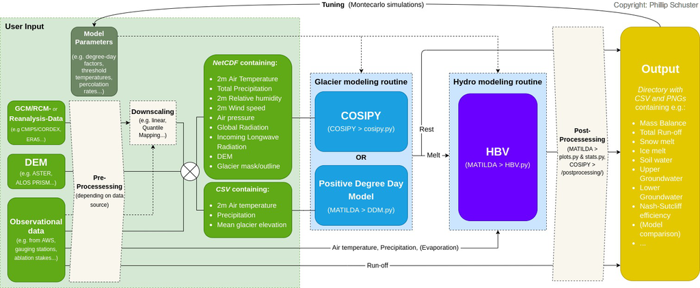

# MATILDA - Modeling water resources In glacierized catchments

The MATILDA model connects the HBV model (Bergström, 1986), a simple hydrological bucket model, which computes runoff and a simple DDM approach to compute the glacier melt. It can also be connected to the glacier mass balance model COSIPY (COupled Snow and Ice energy and MAss Balance in Python) to calculate glacier melt instead of the DDM. The aim is to generate runoff projections under different climate scenarios and use the results to help planing future water management strategies in the modeled catchments. 

## Overview

MATILDA uses a modified version of the pypdd tool (https://github.com/juseg/pypdd.git) to calculate runoff from the glacier(s) with a simple DegreeDayModel approach and a modified version of the LHMP tool (https://github.com/hydrogo/LHMP.git) which translates the HBV model into python. It can run on input data from COSIPY, the translation of the COSIMA model into python (https://github.com/cryotools/cosipy.git), and use the COSIPY output to simulate glacier melt instead of the DDM. The output is then combined and analyzed. The Nash-Sutcliffe efficiency coefficient is calculated to evaluate the predictive skills of the model and several plots are generated to give an overview of the data.



### Requirements

Clone this repo to your local machine using https://github.com/anatappe/MATILDA.git


The tool should run with any Python3 version on any computer operating system. It was developed on Python 3.6.9 on Ubuntu 18.04.
It requires the following Python3 libraries:
- xarray
- numpy
- pandas
- matplotlib
- scipy
- os
- datetime

The MATILDA package and the necessary packages can be installed to you local machine by using pip. Just navigate into the cloned folder and use the following command
```
pip install .
```
or install the package directly from the source by using

```
pip install git+https://git@github.com/anatappe/MATILDA.git

```
### Data

The necessary input a either a csv with a time series of temperature (°C), precipitation (mm) and if possible evapotranspiration (mm) data in the following format or the output netcdf and csv from the COSIPY model. A series of runoff observations (mm) are used to validate the model output. At least daily data is required.

| TIMESTAMP            | T2            | RRR            | PE            |
| -------------        | ------------- | -------------  | ------------- |
| 2011-01-01 00:00:00  | -18.2         | 0.00           | 0.00          |
| 2011-01-01 01:00:00  | -18.3         | 0.1            | 0.00          |
| 2011-01-01 02:00:00  | -18.2         | 0.1            | 0.00          |

| Date          | Qobs          |
| ------------- | ------------- |
| 2011-01-01    | 0.00          |
| 2011-01-01    | 0.00          |


It is also necessary to adjust the parameters of the DDM and the HBV model to the prevailing conditions in the test area. Since the DDM model calculates the glacier melt, it is necessary to scale the input data to the glacier. This can be done with a lapserate for temperature and precipitation and the height difference between the measurement station of the data and the glacier or with a DEM and glacier mask.

### Workflow

The MATILDA package consists of four different modules: DDM, HBV, plots and statistics which have different submodules for the individual steps. 
To use the whole package, the following steps are recommended:
- read in your data and define a spin up and simulation period
- if you only use a csv, define a lapse rate for temperature and precpitation and a height difference between your data and the mean glacier height to downscale your dataframe for the DDM
- define the output frequency (daily, weekly, monthly or yearly)
- use the DDM module to calculate the positive degree days and use the output dataset to run the DDM. Specify the degree day factors here
- run the HBV model with your dataframe. Adjust the parameters for the accordingly. If evapotranspiration is not available, it is calculated automatically
- merge the two output dataframe with your observations to calculate the Nash–Sutcliffe model efficiency coefficient and perform a simple statistical analysis with the tools from the stats module
- plot runoff, meteorological parameters and HBV output series with the plots module 

An example script for the workflow can be found [here](example_workflow.py).

## Built With
* [Python](https://www.python.org) - Python
* [COSIPY](https://github.com/cryotools/cosipy.git) - COupled Snow and Ice energy and MAss Balance in Python
* [pypdd](https://github.com/juseg/pypdd.git) - Python positive degree day model for glacier surface mass balance
* [LHMB](https://rometools.github.io/rome/) - Lumped Hydrological Models Playgroud - HBV Model

## Authors

* **Phillip Schuster** - *Initial work* - (https://github.com/phiscu)
* **Ana-Lena Tappe** - *Initial work* - (https://github.com/anatappe)


See also the list of [contributors](https://scm.cms.hu-berlin.de/sneidecy/centralasiawaterresources/-/graphs/master) who participated in this project.

## License

This project is licensed under the HU Berlin License - see the [LICENSE.md](LICENSE.md) file for details

### References

For COSIPY:
	•	Sauter, T. & Arndt, A (2020). COSIPY – An open-source coupled snowpack and ice surface energy and mass balance model. https://doi.org/10.5194/gmd-2020-21

For PyPDD:
	•	Seguinot, J. (2019). PyPDD: a positive degree day model for glacier surface mass balance (Version v0.3.1). Zenodo. http://doi.org/10.5281/zenodo.3467639

For LHMP and HBV:
	•	Ayzel, G. (2016). Lumped Hydrological Models Playground. github.com/hydrogo/LHMP, hub.docker.com/r/hydrogo/lhmp/, doi: 10.5281/zenodo.59680.
	•	Ayzel G. (2016). LHMP: lumped hydrological modelling playground. Zenodo. doi: 10.5281/zenodo.59501.
	•	Bergström, S. (1992). The HBV model: Its structure and applications. Swedish Meteorological and Hydrological Institute.
